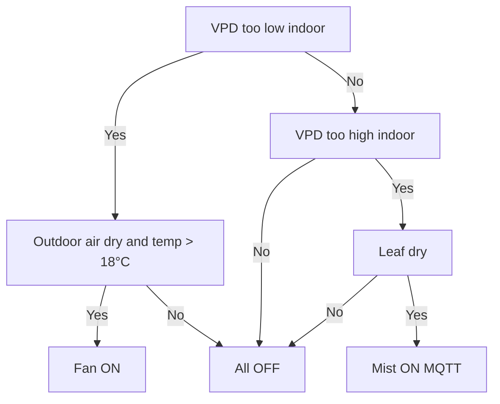

# Mini-Greenhuse - AgroTech final project
This project monitors and controls VPD in a small greenhouse. Temperature and humidity are measured to calculate VPD, which drives a fan or mist to optimize conditions.

### Table of Contents

- [Introduction](#introduction)
- [Background - VPD and Tomatoes](#background---vpd-and-tomatoes)
  - [VPD](#vpd)
  - [Tomatoes](#tomatoes)
- [Hardware and assembly](#hardware-and-assembly)
  - [Electronics](#electronics)
  - [General Structure](#general-structure)
- [Instructions](#instructions)
  - [Hardware](#hardware)
  - [Software](#software)
- [Control and DATA](#control-and-data)
    - [Data Collected](#data-collected)
    - [VPD Control Logic](#vpd-control-logic)
    - [User Interface](#user-interface)

---
## Project Files

### Code
- [[Full Code – Warm Weather]([Full Code - For Warm Weather](https://github.com/LULI09-AGRO/Mini-Greenhuse---AgroTech-final-project/blob/main/Full%20Code%20-%20for%20warm%20weather))](https://github.com/LULI09-AGRO/Mini-Greenhuse---AgroTech-final-project/blob/main/Full%20Code%20-%20for%20warm%20weather)
- [[Demonstration Code](Demonstration Code)](https://github.com/LULI09-AGRO/Mini-Greenhuse---AgroTech-final-project/blob/main/Demonstration%20Code)

### Media
- [ESP32 Wiring Scheme](ESP32_SCHEME.jpg)

---

## Introduction
In our final project, we developed a mini-greenhouse equipped with temperature, humidity, and leaf wetness sensors. These sensors continuously monitor both indoor and outdoor conditions.
Using the collected data, we calculate the Vapor Pressure Deficit (VPD) to assess the plant environment.
Our model plant is tomato, and based on its optimal growth conditions, the system controls humidity using a fan or mist sprayer to maintain ideal growing conditions.

## Background - VPD and Tomatoes

### VPD

VPD, or Vapor Pressure Deficit, is the difference between the amount of moisture in the air and the maximum amount of moisture the air can hold when saturated.
In plant physiology, VPD helps us understand how environmental conditions affect a plant’s ability to grow and produce fruit, by influencing transpiration. 
Transpiration is the movement of water from the roots through the xylem into the leaf mesophyll, followed by evaporation from the leaf into the atmosphere.

**The effects of VPD on plants:**

| VPD Condition       | Effect on Plant |
|--------------------|----------------|
| **High VPD**        | High transpiration → excessive water loss → stomata close → reduced photosynthesis |
| **Low VPD**         | Low transpiration → reduced water and nutrient transport → slower growth |

Therefore, VPD has a major impact on plant growth and fruit production, making it a critical parameter to monitor and control in greenhouse environments.

Stomatal conductance is the rate of gas exchange between the leaf and the atmosphere through the stomata, regulating transpiration and CO₂ uptake for photosynthesis.

### _VPD Calculation_

The formula for calculating VPD using temperature and humidity sensor data is as follows:

VPD = SVP × (1 - RH/100)
SVP = 0.6108 × exp(17.27 × T / (T + 237.3))
* T = Temperature in Celsius (°C)
* RH = Relative Humidity (%)
* VPD result in kPa

### Tomatoes 
### 🍅🍅🍅

Tomato is part of the Solanaceae family, which also includes potato and tobacco. It is one of the most consumed vegetables in the world after potato, with an annual global production of approximately 180–190 million metric tons and an average consumption of around 20 kg per person worldwide.  
Tomato is also one of the most commonly used model plants in plant science and plant physiology.

Therefore, its optimal growing conditions and the effects of environmental factors on its growth have been studied for several decades. From the literature, it is clear that VPD has a significant effect on tomato crop production:

>Yu X., Niu L., Zhang Y., Xu Z., Zhang J., Zhang S., & Li J. (2024). Vapour pressure deficit affects crop water productivity, yield, and quality in tomatoes.

*General VPD ranges for tomatoes and target VPD Range*

The general recommended VPD range for each growth phase is as follows:

| Growth Phase        | Optimal VPD Range (kPa) |
|---------------------|-------------------------|
| Germination         | 0.4 – 0.8               |
| Vegetative Growth   | 0.8 – 1.2               |
| Flowering           | 1.0 – 1.2               |
| Fruiting            | 1.2 – 1.6               |

We decided in this project to simulates the vegetative growth phase of tomato plants. 

## Hardware and assembly

### Electronics

1. [**FireBeetle 2 ESP32-E**](https://wiki.dfrobot.com/FireBeetle_Board_ESP32_E_SKU_DFR0654) 
   - Microcontroller for sensor reading and actuator control  
   

2. [**SHT31 Temperature & Humidity Sensor**](https://wiki.dfrobot.com/SHT31_Temperature_Humidity_Sensor_Weatherproof_SKU_SEN0385)
   - One sensor inside the greenhouse  
   - One sensor outside for reference and control group   

3. [**Leaf Wetness Sensor**](https://store.comwintop.com/products/outdoor-leaf-surface-temperature-and-humidity-moisture-sensor-transmitter-with-rs485-4-20ma-0-5v-output)  
   - Simulates a tomato leaf to measure surface moisture  

4. [**Fan**](https://electronicworld.co.in/product/arx-fd1290-s3033e-12v-dc-0-18a-bldc-cooling-fan/)  
   - DC fan for ventilation and VPD control  
   - Controlled via **relay**
   
  

5. [**Buck Converter**](https://makershop.ie/DC-DC-Buck-5A?srsltid=AfmBOopnSkC795zfUkoyGhVDZ3jdFz4jpy8cIv-9Tf6MlFavQI_Tk2by)  
   - Converts 12V supply to 5V for ESP32 and sensors  

6. [**Relay**](https://www.canadarobotix.com/products/1222?srsltid=AfmBOop1InxmUd8Y3Ksddc2EDyfmVhSQLMjM_4GOhNUmd4CgTlvdJLzY)  
   - Controls Fan and Mist power circuits

### General Structure

The greenhouse is a **plastic box** creating a controlled microclimate.  

- **Side ventilation** allows outside air (via fan) to enter when needed.  
- **Inside**:  
  - SHT31 sensor for indoor VPD  
  - Leaf wetness sensor  
  - Mist sprayer  

The system monitors both indoor and outdoor conditions to decide whether to **ventilate** or **spray mist**.

## Instructions
### Hardware
Connect the components to the ESP32 Firebeetle board as shown in the provided scheme

### _SHT31 Temperature and Humidity Sensors:_
• Indoor Sensor I Connect to the primary I2C pins (SDA to 21 SCL to 22)

• Outdoor Sensor II Connect to designated pins D10 (SDA) and D11 (SCL)
### _Leaf Wetness Sensor:_

• Connect the signal line to analog pin A0

• This sensor requires a Voltage Divider to step down the signal Use a 10k and 20k resistor as shown in the diagram to protect the ESP32
### _Fan Control-Relay_
• Connect the IN pin of the relay to digital pin D2 
• The relay acts as a switch for the 12V fan motor
### _Power Management_ 
• Connect the 12V source to the Buck Converter
• Ensure the output is set to 5V before connecting to the ESP32 and sensors to prevent damage
### Software
Follow these steps to flash the firmware and start monitoring
### _i. Install Libraries_
**Ensure the following libraries are installed in your Arduino IDE:**

• [Adafruit_SHT31 (for environmental sensing)](https://docs.arduino.cc/libraries/adafruit-sht31-library/)

• [PubSubClient (for MQTT communication)](http://pubsubclient.knolleary.net/) 

• [ThingSpeak (for data logging)](https://docs.arduino.cc/libraries/thingspeak/#Compatibility)

### _ii. Communication Details (Open the code and fill in your credentials)_
 WiFi Update WIFI_SSID and WIFI_PASSWORD 
ThingSpeak Enter Think Speak channel number and Think Speak API Key 
MQTT Verify the MQTT_SERVER address for the greenhouse irrigation control

### _iii. Upload Code:_
connect the ESP32 to your computer via USB select the correct COM port and click upload

### _iv. Access Dashboard:_
Once connected open the Serial Monitor (115200 baud) Find the IP address displayed Enter it into any web browser on the same network to view the live Greenhouse Control Dashboard.

  ## Control and DATA
  
### [Data Collected](https://thingspeak.mathworks.com/channels/3222028)

1. **VPD** (calculated from temperature & humidity via SHT31)   - both indoor and outdoor
2. **Leaf Wetness** (RAW - via analog sensor ; Leaf state - 1 for dry, 0 for wet )  
3. **Plant Growth Status** (based on VPD range: 0-100 - 0 for bad growth conditions 100 for the best)  
4. **Fan State** (1 for ON ; 0 for OFF)
5. **Mist state** (1 for ON ; 0 for OFF)

### VPD Control Logic

The system targets a VPD range of **0.8–1.2 kPa**, corresponding to the vegetative growth stage, and controls the environment using the following logic:

| Condition                              | Action |
|---------------------------------------|--------|
| **VPD too low (indoor)**               | Fan ON (only if outdoor air is drier and temperature is safe) to increase effective VPD via air exchange |
| **VPD too high + leaf dry**            | Mist ON via MQTT to increase leaf moisture and reduce VPD |
| **VPD too high + leaf wet**            | No action – misting is blocked to prevent over-wetting and leaf rot |
| **VPD within optimal range**           | All actuators OFF |

### User Interface

All sensor and device data (including the fan and mist sprayer) is displayed on an HTML page designed for easy user access.  
The IP address is shown in the Serial Monitor; you enter it into a web browser to open the dashboard.  
From there, the page updates live with:
- 🌡️ Temperature
- 💧 Humidity
- 🌿 Leaf Wetness
- 🌀 Fan status
- 💦 Mist sprayer status
- 📈 Optimality for growth status
